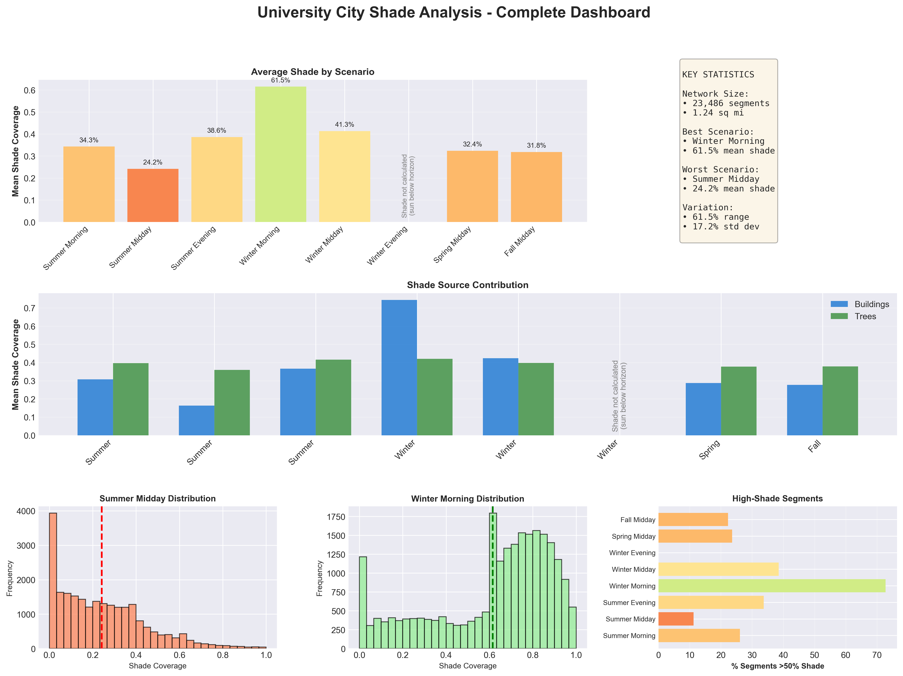
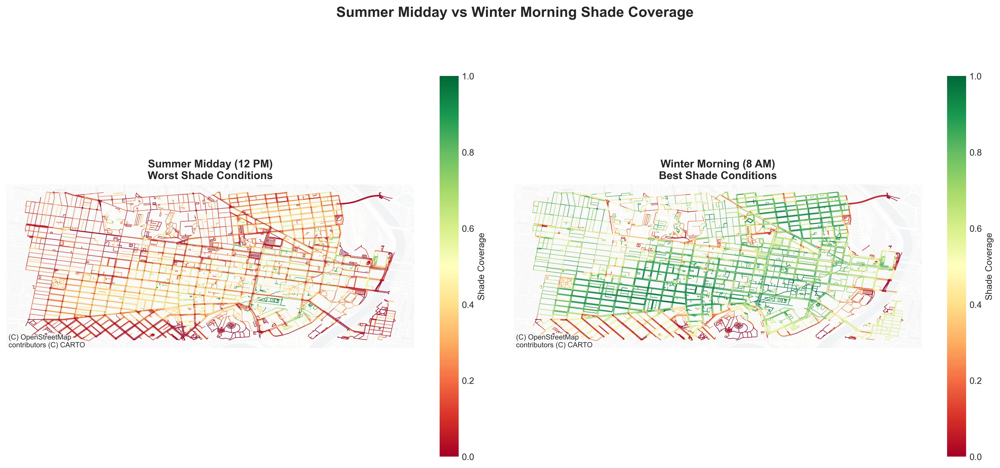
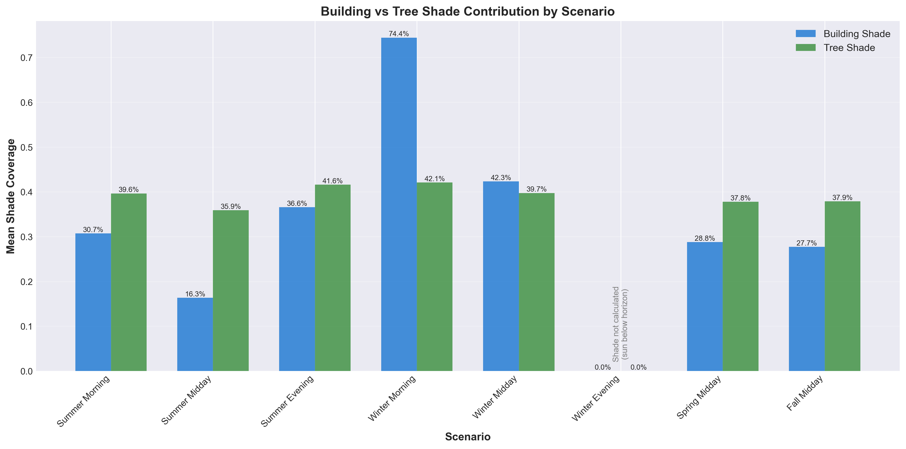
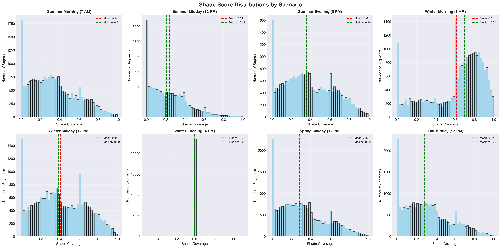
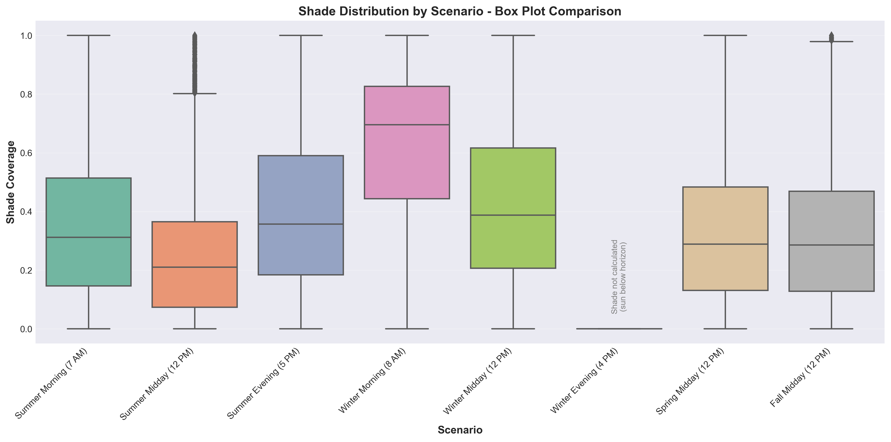

::: {.hero}
# Nadi

**University City, Philadelphia**

Routing pedestrians through shade using LiDAR-derived shadow models across 23,486 street segments

[Try the Interactive Map →](interactive.qmd){.btn .btn-primary}
[View Results →](results.qmd){.btn}
:::

---

{width=100%}

---

Standard navigation apps optimize for distance and time. They don't account for thermal comfort — which means pedestrians often get routed through sun-exposed corridors during Philadelphia's increasingly intense summers, where surface temperatures can exceed 130°F in direct sun.

Nadi models shadow coverage across University City's pedestrian network using high-resolution LiDAR data, then routes walkers through shadier paths. A typical detour of 10-15% yields 30-50% more shade coverage.

---

## How it works

Shadow coverage is calculated geometrically for each of 23,486 street segments using real building heights and individual tree heights extracted from USGS LiDAR point clouds. Sun position is modeled using `pvlib` across 8 temporal scenarios — summer, winter, and spring/fall mornings, middays, and evenings.

For each building or tree at height $h$ with sun at altitude $\alpha$:

$$\text{shadow\_length} = \frac{h}{\tan(\alpha)}$$

Shade scores weight buildings at 60% and trees at 40%, reflecting buildings' more consistent shadow geometry. Routes are calculated using Dijkstra's algorithm with a shade-weighted cost function:

$$\text{cost} = \text{length} \times (1 - 0.3 \times \text{shade})$$

A fully shaded segment effectively costs 30% less than an unshaded one of the same length, nudging the algorithm toward shadier paths without forcing extreme detours.

{width=100%}

---

## What the data shows

Shade availability varies by a factor of 2.5x across the year — from 61.5% average coverage on winter mornings to 24.2% on summer middays. That variation is what makes time-aware routing useful.

{width=100%}

Buildings and trees contribute differently depending on sun angle. In winter, low sun angles cast long building shadows that dominate coverage (74.4% contribution). In summer, the sun moves overhead and tree canopy becomes the primary shade source (35.9% vs 16.3% from buildings) — which has direct implications for where street tree investments have the most pedestrian impact.

{width=100%}

The spatial pattern of shade deserts — concentrated on Market Street, Chestnut Street, and University Avenue during summer midday — points to specific corridors where canopy investment would have the highest impact.

{width=100%}

---

## Results

::: {.grid}

::: {.g-col-3}
**Network**  
23,486 segments  
27 miles analyzed
:::

::: {.g-col-3}
**Best coverage**  
Winter morning  
61.5% average shade
:::

::: {.g-col-3}
**Worst coverage**  
Summer midday  
24.2% average shade
:::

::: {.g-col-3}
**Typical trade-off**  
+10-15% distance  
+30-50% shade
:::

:::

{width=100%}

{width=100%}

---

## Data sources

| Dataset | Source |
|---|---|
| LiDAR point clouds | USGS 3D Elevation Program (2018-2020) |
| Building footprints | Pennsylvania Spatial Data Access (PASDA) |
| Street network | OpenStreetMap via OSMnx |
| Transit stops | SEPTA GTFS |

**Stack:** Python, GeoPandas, Rasterio, NetworkX, pvlib, Leaflet.js, Quarto

---

**Kavana Raju** | University of Pennsylvania
[kavana@upenn.edu](mailto:kavana@upenn.edu) | [GitHub](https://github.com/kavanaraju/Pedestrian-Shade-Routing)