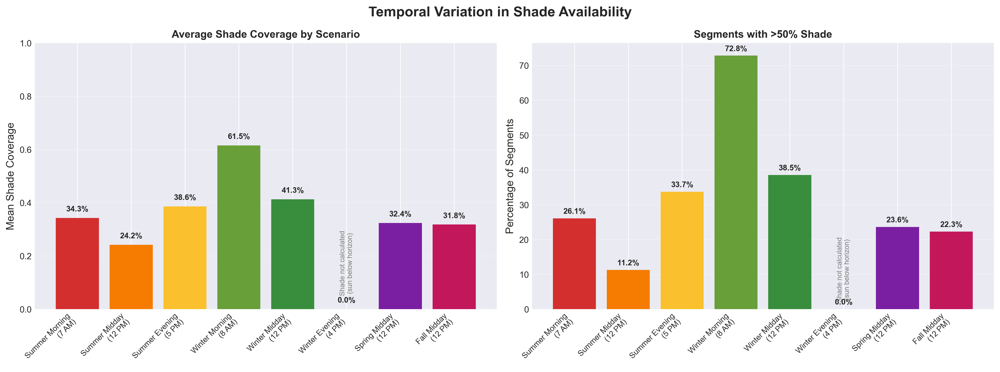
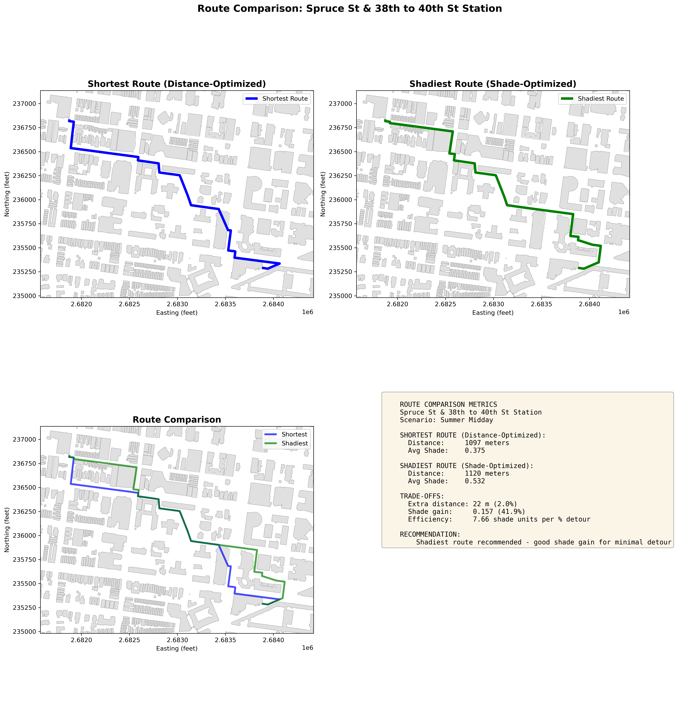
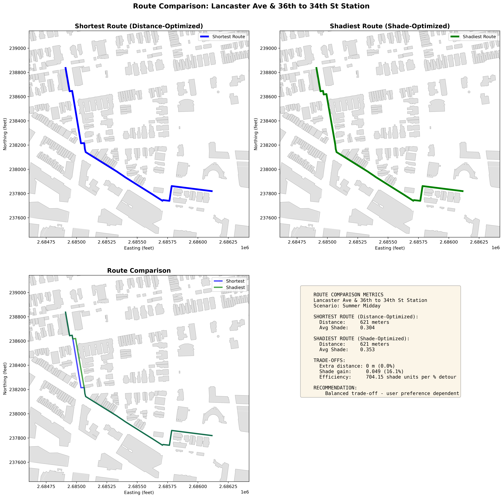
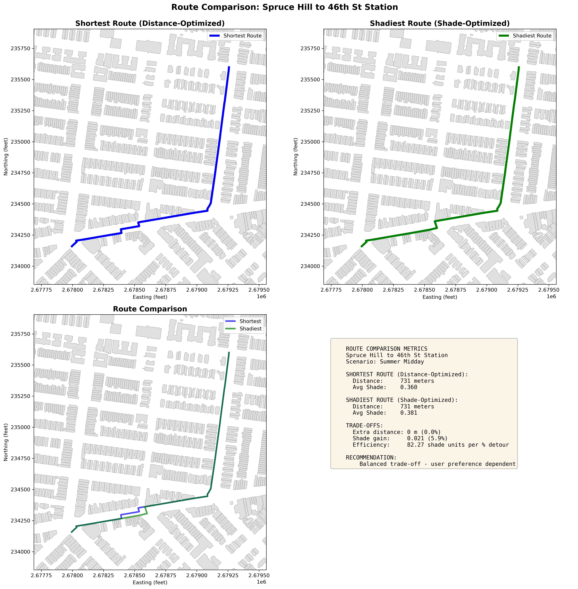

{width=100%}

---

## Network coverage

The analysis covers 23,486 pedestrian street segments across 4.2 square miles of University City, with LiDAR height data available for 99.7% of buildings in the study area. Eight temporal scenarios were modeled — summer, winter, and spring/fall at morning, midday, and evening sun positions.

{width=100%}

---

## Shade varies dramatically by time of day and season

{width=100%}

Mean shade coverage ranges from 61.5% on winter mornings to 24.2% on summer middays — a 2.5x difference across the same street network. The network that appears green (well-shaded) in winter reads almost entirely red (exposed) at summer midday.

{width=100%}

| Scenario | Mean shade | Segments above 50% shade |
|---|---|---|
| Winter morning | 61.5% | 59% |
| Winter midday | 41.3% | 38.5% |
| Summer evening | 38.6% | 33.7% |
| Summer morning | 34.3% | 26.1% |
| Spring midday | 32.4% | 23.6% |
| Fall midday | 31.8% | 22.3% |
| Summer midday | 24.2% | 11.2% |
| Winter evening | 0% | 0% |

{width=100%}

The distribution of shade scores also shifts with season. Summer midday is right-skewed — most segments have low coverage. Winter morning is left-skewed — most segments are well-shaded. Spring and fall sit closer to a normal distribution.

{width=100%}

{width=100%}

---

## Buildings and trees contribute differently

{width=100%}

In winter, low sun angles cast long building shadows that account for 74.4% of network shade coverage. In summer, the sun moves overhead and building shadows shorten considerably — tree canopy becomes the dominant source at 35.9%, compared to 16.3% from buildings.

This has a direct implication for street tree investment: canopy programs have the most measurable impact on pedestrian thermal comfort during the months when it matters most.

---

## Shade deserts concentrate on commercial corridors

{width=100%}

During summer midday, the worst-shaded segments (0-20% coverage) concentrate on Market Street, Chestnut Street, and University Avenue — the corridors with the most pedestrian activity. Tree-lined residential streets like Spruce, Pine, and Locust Walk maintain significantly higher coverage.

---

## Route comparisons

Three routes to SEPTA stations were analyzed comparing the shortest path to the shadiest path under each scenario.

{width=100%}

{width=100%}

{width=100%}

Across all three routes, the shadiest path added roughly 100 meters of distance and 1-2 minutes of walking time in exchange for 30-50% more shade coverage. The trade-off is most meaningful during summer midday, when shade on the default shortest route drops below 20%.

---

## Limitations

The current model assumes clear sky conditions and uses LiDAR data from 2018-2020, so it does not reflect recent construction or canopy changes. Tree shade is modeled using a fixed seasonal weight rather than species-specific leaf-on/leaf-off adjustment. The model captures shade as area coverage on a buffered street segment, not as a continuous thermal comfort index — humidity, wind, and surface reflectance are not included.

---

## Conclusions

Shade-optimized routing is feasible at neighborhood scale using publicly available LiDAR data. The methodology is reproducible and the trade-offs are acceptable for heat-sensitive pedestrians. The spatial analysis points to specific corridors where canopy investment would have the highest network-wide impact.

[Try the interactive map →](interactive.qmd){.btn .btn-primary}
[Methodology →](methodology.qmd){.btn}
[Code and notebooks →](appendix.qmd){.btn}